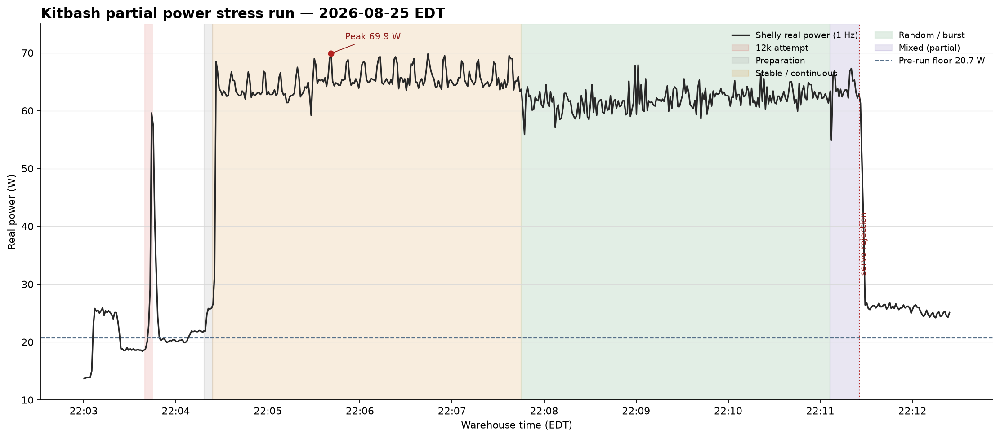
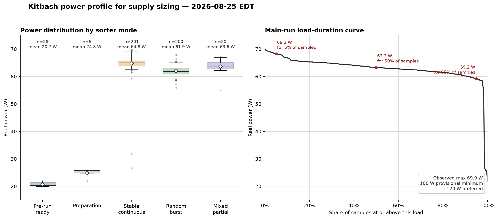
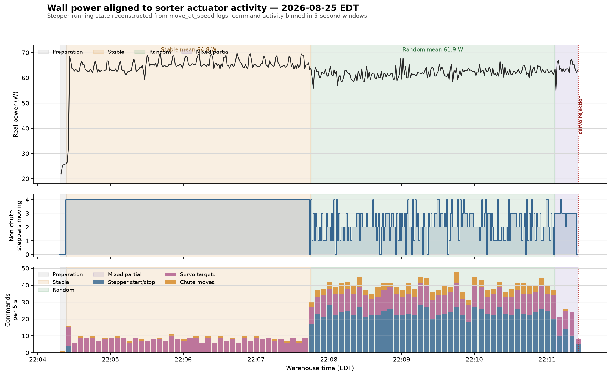

# Kitbash power stress test — partial report

Test date: 2026-08-25 EDT  
Machine: Kitbash / spencer-02  
Status: incomplete; 7 min 7 s of the 10 min main run completed

## Summary

The main run completed the full stable and random phases and 19 seconds of the first mixed segment. Across the 427-second run, wall draw averaged **62.9 W**, reached **68.3 W at the 95th percentile**, and peaked at **69.9 W**. Approximate wall energy was **7.45 Wh**.

The run stopped because firmware rejected a command to move servo channel 2 to 0°. This was not accompanied by loss of wall power or input-voltage sag. The nearest Shelly sample was 62.9 W at 118.0 V, followed by the expected power decline during test cleanup. Kitbash returned to `ready` with no hardware error.

These results establish a useful provisional load envelope, but they are not a completed worst-case qualification. Only 19 of the planned 200 mixed-mode seconds ran, Shelly samples at 1 Hz and can miss shorter peaks, and the servos were mechanically unloaded.

## Main run configuration

| Item | Setting |
| --- | ---: |
| Target duration | 600 s |
| General stepper speed | 6,000 microsteps/s |
| Chute speed | 3,000 microsteps/s |
| Chute maximum | 345° |
| Non-chute steppers | 4 |
| Servos | 3 |
| LED outputs | 2, full on during the run |
| Perception workers | 3 of 3 alive |
| Configured camera roles | 5 |
| Distribution firmware | `firmware/v0.8.0`, `distribution-v1-2` target |
| Run ID | `9fafd9e1-178a-46bc-ba4d-00bd19981b29` |

The chute homed successfully before motion began. The physical v1.3 distribution board identifies and is released under the repository's `distribution-v1-2` firmware target.

## Wall-power results

| Window | Completed | Mean | Increase over pre-run floor | P95 | Peak | Approx. energy |
| --- | ---: | ---: | ---: | ---: | ---: | ---: |
| Pre-run ready floor | 28 s sampled | 20.7 W | — | 21.9 W | 22.0 W | 0.16 Wh |
| Preparation and chute home | 5.4 s | 24.8 W | +4.1 W | 25.9 W | 25.9 W | 0.03 Wh |
| Stable: all four steppers continuous, chute/servos sweeping | 201.1 s | **64.8 W** | **+44.1 W** | **69.0 W** | **69.9 W** | 3.60 Wh |
| Random: all four steppers bursting, chute/servos random | 200.9 s | 61.9 W | +41.2 W | 65.0 W | 67.9 W | 3.43 Wh |
| Mixed segment 1: two continuous and two burst steppers | 19.0 of 45 s | 63.6 W | +42.9 W | 66.9 W | 67.3 W | 0.33 Wh |
| **Entire main run** | **427.0 s** | **62.9 W** | **+42.2 W** | **68.3 W** | **69.9 W** | **7.45 Wh** |
| Post-run ready state | 55 s sampled | 25.6 W | +4.9 W | 26.6 W | 26.8 W | 0.38 Wh |

The main run held 117.9–118.5 V at the plug. Mean AC input current was 0.883 A and the recorded maximum was 0.975 A. Voltage × current gives approximately 104 VA mean and 115 VA peak; the difference from real watts is the load's power factor and is relevant to upstream AC wiring, UPS, and inverter sizing.

The highest sustained load was the stable phase with all four non-chute steppers running continuously. Random stopping and restarting did not exceed that phase at the Shelly's one-second resolution.

## Phase distribution and load duration

The phase distributions show that this was a sustained load rather than a result dominated by one spike. Half of the main-run samples were at or above 63.3 W, 25% were at or above 65.0 W, and 5% were at or above 68.3 W. Even 95% of the samples were at or above 59.2 W; the final low tail is preparation and phase-transition cleanup.

Stable continuous motion had a 65.0 W median and 64.8 W mean. Random burst motion had a 61.9 W median and mean. The 2.8 W difference between those modes is more useful for sizing than the command rate alone.

## Correlation with sorter activity

The correlation chart aligns Shelly samples with actual `move_at_speed`, servo-target, and chute-move messages from the sorter journal. Non-chute stepper running state was reconstructed from every nonzero and zero speed command. Command activity is grouped into five-second bins so it remains readable against the one-second power measurement.

| Mode | Non-chute stepper behavior | Stepper start/stop commands | Servo target commands | Chute move commands | Mean power |
| --- | --- | ---: | ---: | ---: | ---: |
| Stable | All 4 continuously moving | 4 | 318 | 19 | 64.8 W |
| Random | 0–4 moving as bursts overlap | 946 | 473 | 172 | 61.9 W |
| Mixed partial | 2 continuous plus 2 bursting | 41 | 42 | 1 | 63.6 W |

The important result is that **command count is not a reliable power proxy**. Random mode generated far more host commands but used less power than stable mode. Within random and partial mixed operation, one-second power versus reconstructed non-chute steppers moving had Pearson `r ≈ 0.04`, which is no meaningful linear relationship at this resolution. Enabled drivers still draw holding current while stopped, bursts change faster than the Shelly's integration window, and chute/servo loads overlap.

Sorter operating mode correlates more usefully with power than individual commands: four continuously moving steppers added about 2.8 W over burst mode, while both modes remained near a 62–65 W sustained plateau. Supply sizing should therefore use the phase envelope and observed peak, not multiply a per-command estimate.

## Timeline

All times below are warehouse time, EDT. Epoch timestamps from the test recorder were converted directly; the Kitbash journal's displayed `+0800` timestamps were not interpreted as local warehouse time.

| Time | Event |
| --- | --- |
| 22:03:39 | Initial 12,000 microsteps/s attempt started. |
| 22:03:44 | Initial attempt stopped after 5.2 s: stall detected on channel 4. The short attempt peaked at 59.6 W but never reached steady state. |
| 22:04:18 | Main 6,000 microsteps/s run started; chute home began. |
| 22:04:23 | Chute home completed at 66.75°; LEDs were set fully on; all three perception workers were verified alive. |
| 22:04:23 | Stable phase started. |
| 22:07:45 | Stable phase completed: 106–108 servo commands per channel and one continuous command per non-chute stepper. |
| 22:07:45 | Random phase started. |
| 22:11:06 | Random phase completed: 233–241 stepper start/stop commands per channel and 157–161 servo commands per channel. |
| 22:11:06 | Mixed segment 1 started. Channels 1 and 3 used burst mode; channels 2 and 4 ran continuously; servos were random and the chute swept. |
| 22:11:24 | Servo channel 2 attempted 180° → 0°; firmware rejected the command as busy or disabled. |
| 22:11:25 | Runner recorded failure and performed cleanup. |
| 22:11:29 | Wall draw had fallen to 26.4 W. |

## Failure assessment

The main run ended on `Servo 2 rejected target 0`. The host had observed the servo as stopped before issuing the move, but the firmware returned rejection. The available response does not distinguish a transient busy state from a disabled state, so the precise firmware-side cause remains unresolved.

There is no evidence that the rejection was caused by inadequate incoming power:

- Wall input was 118.0 V at the failure sample, within the 117.9–118.5 V run range.
- Real power was still 62.9 W when the failure was recorded.
- The Shelly collector reported zero polling failures during the test window.
- Kitbash remained online, cleanup ran, and hardware state returned to `ready` with no error.

The earlier 12,000 microsteps/s attempt stopped because channel 4's stall guard fired. The 6,000 microsteps/s run then sustained all four steppers through the complete stable and random phases, making 6,000 microsteps/s the highest speed demonstrated by this session rather than the physical or electrical maximum.

## Provisional power-supply implication

For a single supply intended to cover the same aggregate load seen by this outlet:

- **Measured wall peak:** 69.9 W real power at 1 Hz.
- **Minimum provisional capacity:** 100 W continuous, providing about 43% above the measured peak.
- **Preferred provisional capacity:** 120 W continuous, providing about 72% above the measured peak for unobserved sub-second transients, loaded servos, and the unfinished mixed sequence.
- **Upstream AC/UPS envelope:** allow at least 115 VA based on recorded voltage × current, plus normal design margin.

This does not yet determine the required current for any individual DC rail. The plug measures aggregate AC input, including the Orange Pi, cameras, NPU, lighting, servos, motor electronics, and conversion losses. A final DC supply selection still needs output-voltage and rail-current measurements or a known rail topology and efficiency budget.

## Measurement limits

- The Shelly plug sampled at approximately 1 Hz. Shorter motor and servo transients can be higher than 69.9 W.
- The plug measures one outlet. It includes Kitbash and the distribution motor rail demonstrated in prior measurements, but anything powered from another outlet is absent.
- The mixed phase was only 19 seconds; four later mixed segments did not run. About 70% of scheduled motion time completed.
- The servos were electrically exercised but mechanically unrestricted. Installed mechanisms can increase servo current.
- `ts` is dummy's poll-return timestamp, with roughly one second of alignment uncertainty against the machine events.

## Sources

- Backend power-stress run records for run IDs `85a0595f-48e1-4509-9ff0-5795daafcd27` and `9fafd9e1-178a-46bc-ba4d-00bd19981b29`.
- Kitbash `sorter-backend-dev.service` journal covering 22:03–22:12 EDT.
- 700 Shelly lake records covering the test and surrounding baseline, with zero collector failures in the run window.

## Next measurement

After the servo command rejection is handled, repeat the 600-second run at 6,000 microsteps/s. Treat the result as final only after all five mixed segments complete. If the supply decision is close to the measured envelope, capture push telemetry or rail-side current at higher resolution before reducing the 120 W provisional recommendation.
